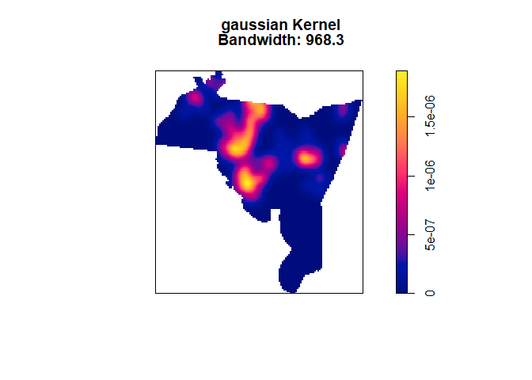
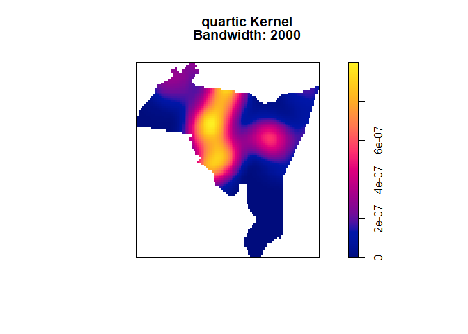
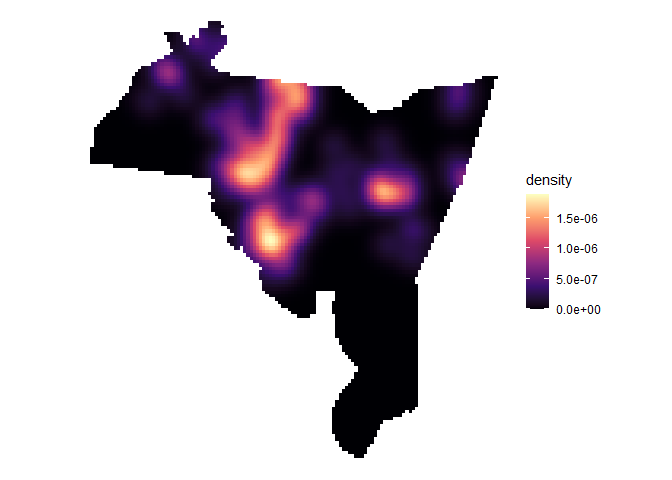
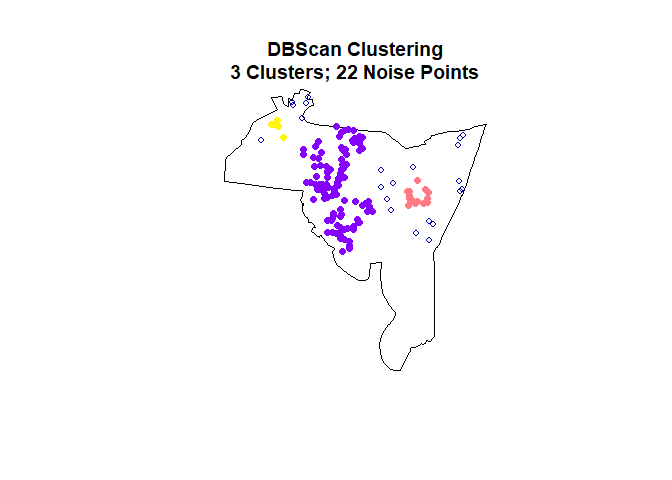

<!-- README.md is generated from README.Rmd. Please edit that file -->

# crimtools

<!-- badges: start -->
<!-- badges: end -->

`crimtools` is a collection of packages intended to make it easier for
researchers to perform common data analyses on spatial data. This
package interfaces with spatial data in `sf` format and provides
functions to help plotting static maps via `ggplot2` or interactive maps
via `maptools`. This is also intended to serve as a centralized point
for basic spatial analyses as many of the previous packages are no
longer being updated (such as `GISTools`) or are being depricated in
favor of `sf`, `stars` and `terra` (see
[here](https://r-spatial.org//r/2022/04/12/evolution.html) ). The core
functionality of `crimtools` is based around either raster or areal
analyses. While this package is still in active development, the
intended main functions will be:

1.  Kernel density mapping
2.  Spatial grids and grid counts
3.  LISA statistics (Moran’s I, Getis Ord Gi\*)

In the future, other functionalities provided in commercial tools
(i.e. ArcGIS) will be ported to `crimtools`.

## Installation

You can install the development version of crimtools from
[GitHub](https://github.com/) with:

``` r
# install.packages("devtools")
devtools::install_github("gmcirco/crimtools")
```

## Tools Available

The `crimtools` package is intended to be used with simple features from
the `sf` package (see [this
link](https://r-spatial.github.io/sf/articles/sf1.html) for a more
in-depth description of simple features in R). Currently, the following
analyses are supported:

1.  [Kernel density estimation](#kde)
2.  [DBCAN point clustering](#dbs)

## Kernel Density Estimation

The `kernel_density` function requires, at a minimum, a point feature
`x` and an enclosing polygon feature `region`. Both of these should be
`sf` objects and should (ideally) be projected into feet or meters. By
default, `kernel_density` will automatically estimate a bandwidth by
using the `bw.ppl` function as part of `spatstat.core`. However, users
can (and should) provide a bandwidth size that reflects domain knowledge
about the relevant feature. Users can also provide a custom function to
estimate the bandwidth, or use several of those available in `spatstat`.

``` r
# Load necessary libraries
library(crimtools)
library(sf)
#> Linking to GEOS 3.9.1, GDAL 3.3.2, PROJ 7.2.1; sf_use_s2() is TRUE

# Load example data
data("newhaven")
data("nh_hom")

# Default output, gaussian kernel
kde_out <- kernel_density(x = nh_hom, region = newhaven)
#> Calculating bandwidth...
#> Bandwidth: 968.3
```



The kernel type, bandwidth, and other features can be manually adjusted
as well.

``` r
# Specifying a quartic kernel with 2000 foot bandwidth
kde_out2 <- kernel_density(x = nh_hom, 
                           region = newhaven, 
                           kernel = "quartic", 
                           bdw = 2000)
```



By default `kernel_density` returns a dataframe with columns for the
density value and the x and y coordinates of cell centroid.

``` r
head(kde_out)
#>        density        X        Y
#> 1 1.197927e-07 542833.5 188306.0
#> 2 1.045117e-07 543129.5 188306.0
#> 3 9.759517e-08 543425.6 188306.0
#> 4 9.653314e-08 543721.6 188306.0
#> 5 1.622905e-07 542833.5 187988.7
#> 6 1.444024e-07 543129.5 187988.7
```

The exported dataframe can easily be plotted using `ggplot2`
functionality, or used as a variable in an analysis. This allows for
easy customization using the large number of options available in
`ggplot2`

``` r
library(ggplot2)

# plot as a ggplot2 object using geom_tile
# and setting coord_equal
ggplot(kde_out) +
  geom_tile(aes(x = X, y = Y, fill = density)) +
  coord_equal() +
  scale_fill_viridis_c(option = "magma") +
  theme_void()
```



## DBSCAN Point Clustering

Given a region and point pattern, this function computes clusters based
on user-defined search parameters. Here, this is the `dist` measure and
`minPts` measure. This means we will search for clusters that are within
a 2000 foot radius of a ‘core’ point, and contain a minimum of 5 points.
By default, this function will output an image displaying the number of
identified clusters and ‘noise’ points, as well as an `sf` point object
with the cluster IDs attached.

``` r
# Run DBSCAN
cluster_out <- cluster_points(x = nh_hom, region = newhaven, dist = 2000, minPts = 5)
```



    #> DBSCAN clustering for 161 objects.
    #> Parameters: eps = 2000, minPts = 5
    #> The clustering contains 3 cluster(s) and 22 noise points.
    #> 
    #>   0   1   2   3 
    #>  22 114  19   6 
    #> 
    #> Available fields: cluster, eps, minPts

    # check cluster ids
    table(cluster_out$K)
    #> 
    #>   0   1   2   3 
    #>  22 114  19   6
