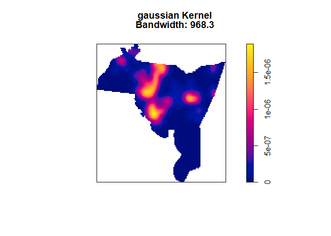
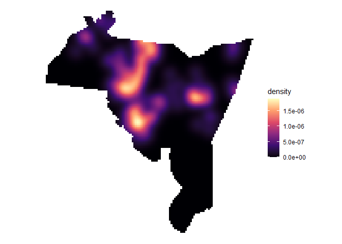

<!-- README.md is generated from README.Rmd. Please edit that file -->

# crimtools

<!-- badges: start -->
<!-- badges: end -->

The goal of crimtools is to …

## Installation

You can install the development version of crimtools from
[GitHub](https://github.com/) with:

``` r
# install.packages("devtools")
devtools::install_github("gmcirco/crimtools")
```

## Example

This is a basic example which shows you how to solve a common problem:

``` r
library(crimtools)
library(sf)
#> Linking to GEOS 3.9.1, GDAL 3.3.2, PROJ 7.2.1; sf_use_s2() is TRUE
data("newhaven")
data("nh_hom")

kde_out <- kernel_density(x = nh_hom, region = newhaven)
#> Calculating bandwith...
#> Bandwidth: 968.3
```



What is special about using `README.Rmd` instead of just `README.md`?
You can include R chunks like so:

``` r
library(ggplot2)

ggplot(kde_out) +
  geom_tile(aes(x = X, y = Y, fill = density)) +
  coord_equal() +
  scale_fill_viridis_c(option = "magma") +
  theme_void()
```


